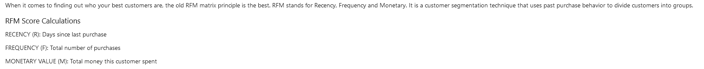
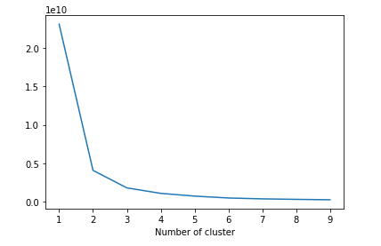
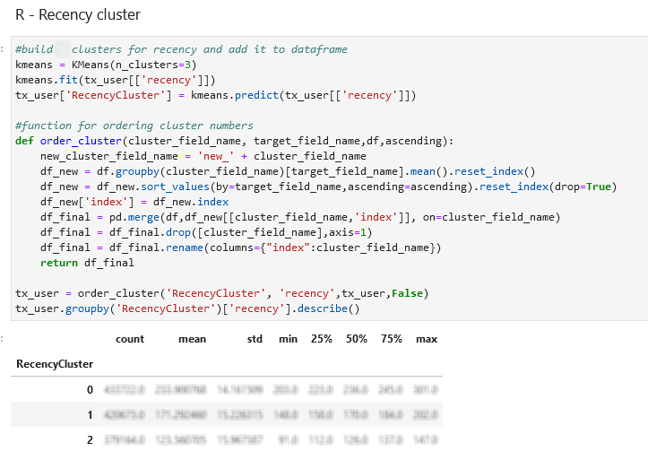
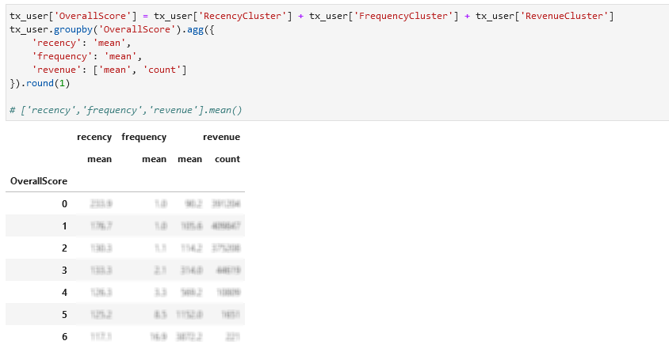
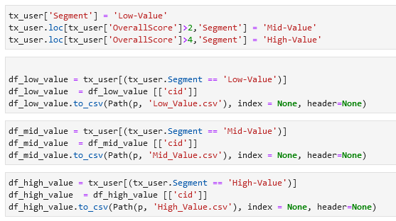
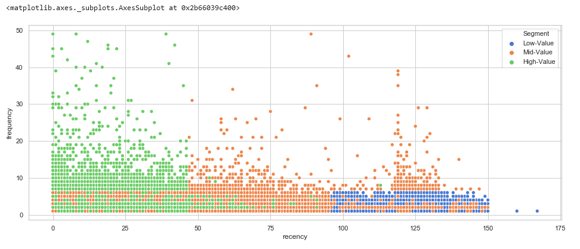

# clustericus

Automated solution for creating user cluster for creating user retention and remarketing strategies. As metrics were used RFM calculated based on log data, as algorithm -  K-means as a very simple but also reliable and well-documented one. 

# logic of code

This program:

1. Extracts event log data from Qubole account (SQL template is attached)
2. Transforms the local currency revenue data into EUR, cleans the data
3. Calculates RFM metrics per user by User Id

4. Creates user cluster via K-means algorithm by R, F, and M metrics separately. 

5. Build the cumulative User Score index to identify High-, Mid- and Low- valuable users

6. Creates automatically CSV file for each group containing user-id from each group for upload into the DMP of the client choice

7. Creates visualization of built clusters

# usage

To make this program run:

- in the script **Cluster_Analysis_RFM_KM.ipynb** replace 'xxx' placeholders by your Qubole API credentials in the beginning, adjust mail addresses at the end 
- run the script, approx. execution time 45 mins, depends on the log size 

# output

The result of script execution are three CSV files saved in the same folder as the notebook file.

Also in the executed notebook willbe displayed code outputs showing the process of the analysis and mid results with visualizations. 
For confidential reasons code outputs was removed from attached file.

# results implementation

The results of the script were implemented already on a couple of e-commerce clients campaigns, their performance has validated this approach. 
The prepared user clusters showed 6x higher ROI as granular targeted prospecting strategies (with contextual, audience, and whitelist segments), and 3x higher ROI compare with traditional Remarketing, where the pool consisted of the users contacted in the last 90 days and didn't convert yet. 
The main problem of implemented user clusters was their low scale, which can be solved via the creation of additional Look-a-Likes segments.

# improvement to be made

- creating K-means clusterization based on all three parameters together and not separately
- test SVM algorithm and compare the results with K-means
- creating based on the model insights user classification models to score prospecting users
- deployment as stand-alone application

